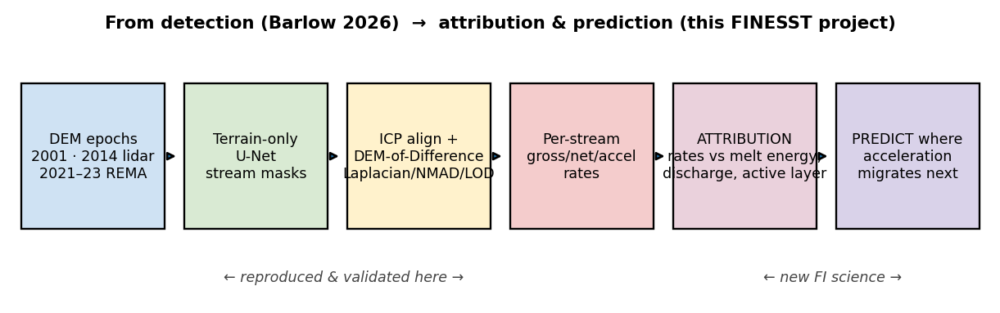
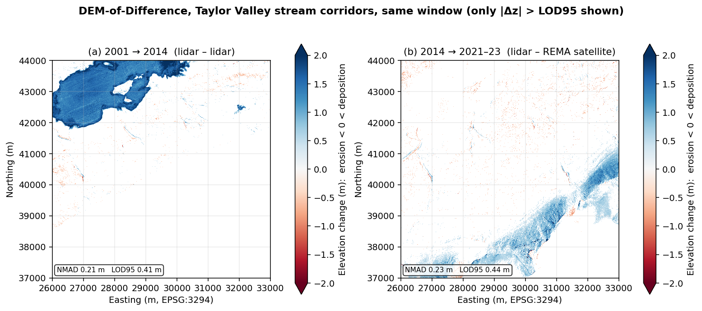
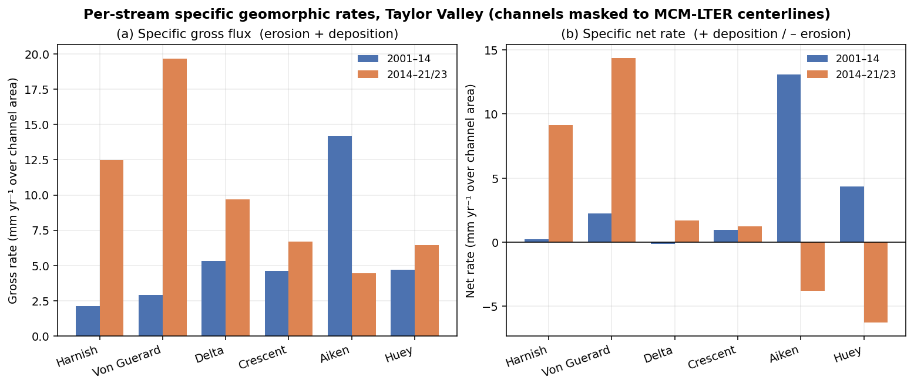
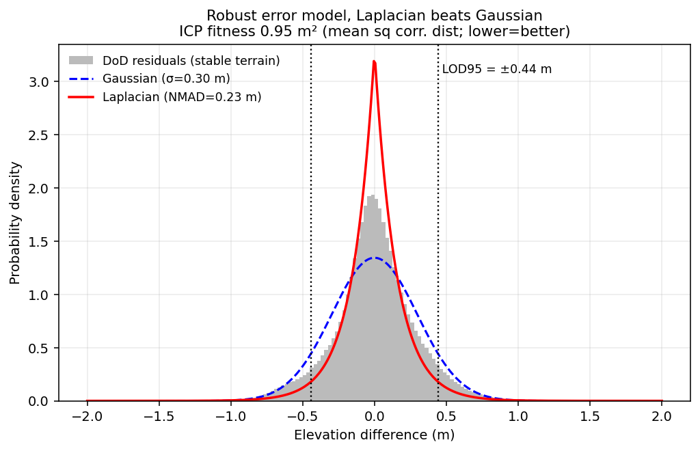
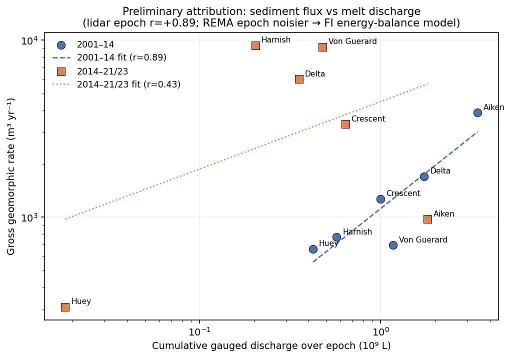

# From Detection to Attribution: Tracking and Explaining Stream Change in Antarctica from Terrain Alone

**NASA ROSES-2025 F.5: Future Investigators in NASA Earth and Space Science and Technology (FINESST)**
**Division:** Earth Science (EARTH25), Antarctic cryosphere / climate
**Deadline:** 14 July 2026 (11:59 PM EDT)
**Roles:** Grad student is the Future Investigator (FI), lead and main author; advisor is PI on record. Up to ~$50k/yr for up to 3 years.

> **Summary.** A working tool already *finds* where Antarctic streams are reshaping the land, but it
> stops at location: it says where, never why. This project starts at that line. I'll connect the
> measured change to the processes driving it (heat, melt, thawing ground), make the detector work
> across different sensors and all four valleys, and attach a real uncertainty value to every
> pixel. I've already rebuilt and verified the existing pipeline myself and recovered the first
> driver signal, so this is a concrete next step I'm ready to run, not a proposal resting on
> untested machinery.

---

## 1. The setup and the gap

The **McMurdo Dry Valleys (MDVs)** are the largest ice-free region in Antarctica, a cold polar
desert of bare rock and gravel. For roughly a century they were treated as the most
geomorphically stable place on Earth, but that's no longer holding. The system sits right at the
energy threshold for melting, so small increases in absorbed heat are enough to melt ice and
degrade permafrost. The visible result is **ephemeral streams**: channels that flow for a few weeks
each summer, transport sediment, and reshape the channel before going dry again.

Those streams are the clearest climate signal available in an otherwise stable landscape. If they
accelerate, that's an early indicator worth taking seriously.

**Barlow (2026)** [1] built the tool that measures them, and it rests on three components worth
naming:

1. **Terrain-only segmentation.** A **U-Net** (an image-segmentation CNN) traces stream channels
   from the shape of the ground alone (elevation, slope, aspect). There's no water signal to key
   off, since the channels are dry most of the year.
2. **Validating the free satellite data.** Airborne lidar is the accuracy benchmark but only exists
   for 2001 and 2014. Extending past 2014 means using **REMA** (free satellite elevation models).
   She showed REMA is good enough via **ICP** (a 3D alignment method) and **NMAD** (a
   median-based, outlier-robust spread estimate that's far more reliable here than standard
   deviation).
3. **Measuring change.** Differencing an old elevation surface from a newer one inside the channels
   gives a **DEM-of-Difference (DoD)**. Only changes above the noise floor
   (**LOD95 = 1.96 × NMAD**) count. Summed per stream, that yields erosion/deposition rates and
   even acceleration.

**The gap.** Barlow's work ends at *description*. It maps **where** change happens (Denton Hills
erodes hardest; parts of Taylor Valley are accelerating) but explicitly leaves two things for
future work: **(a)** linking the change to its physical and climate **drivers**, and **(b)**
making the model work **beyond the MDVs**. That's the natural space for a Future Investigator
project: moving from a tool that *watches* to one that *explains and predicts* (Fig. 1).

***Figure 1.*** *Left (detect): Barlow's pipeline, which I've rebuilt and verified. Right (explain
and predict): the new work proposed here.*

---

## 2. What I'll do (objectives and hypotheses)

| # | Objective | Hypothesis | Why it's new |
|---|---|---|---|
| **O1** | **Attribution (the headline).** Relate each stream's change rate to its drivers: temperature, insolation, **positive-degree-days (PDD)** (cumulative above-freezing heat), melt-season discharge, glacier melt, and active-layer (thaw) depth, drawn from the LTER field network plus ERA5/AMPS reanalysis. | **H1:** Change is governed by *cumulative melt energy*, not raw water volume. An energy-based model outperforms a discharge-only model and explains the residual scatter in Fig. 5. | Barlow lists this as future work; it hasn't been quantified. |
| **O2** | **Generalization.** Make the terrain-only detector work across both lidar (2001/2014) and REMA, and across all four valleys. The obstacle is **domain shift**: lidar and satellite represent the surface differently, which degrades the satellite epoch. | **H2:** A sensor-aware correction (conditioned on slope/aspect, per pixel) closes most of the lidar-vs-REMA gap. | Barlow flags sensor generalization as future work. |
| **O3** | **Calibrated uncertainty.** Replace the single global noise value with a **per-pixel, sensor-aware** one, so every change map carries a defensible confidence layer. | **H3:** Conditioning NMAD on slope, aspect, and sensor produces a 95% bound that actually holds 95% of the time. | Barlow uses one global value per epoch pair. |

**The unifying payoff:** a model that takes a driver field and predicts **where acceleration
migrates next**, which is the operationally useful form of the climate-indicator idea.

---

## 3. Approach

**Data (all free/public, already pulled; see §6).** Elevation: MDV lidar 2001 (2 m) and 2014 (1 m),
plus REMA satellite (2 m, 2021–23). From each I build the standard terrain layers: elevation,
slope, aspect, **profile curvature** (signed, so it distinguishes concave channels from convex
ridges), **MFD flow accumulation**, and lidar intensity. Drivers: LTER meteorology, **21 stream
gauges**, glacier melt for 7 glaciers, and continuous soil temperature/moisture as an active-layer
proxy; ERA5 and AMPS reanalysis fill spatial gaps. Labels: LTER stream centerlines, a public
stand-in for Barlow's private hand-drawn training tiles (the one access constraint; see §7).

**O1, attribution.** For each gauged stream and epoch I'll: **(i)** take the change rate from the
DoD inside the channel (already operational, Fig. 2); **(ii)** assemble a per-stream **energy time
series** (PDD, insolation, discharge, thaw depth); **(iii)** fit rate-vs-driver models
(hierarchical regression and random forest) with leave-one-stream-out validation; and **(iv)** test
H1 directly: energy-based model against discharge-only. Fig. 5 is the preliminary version of this;
the discharge relationship is real but leaves structured residuals, which is exactly what an
energy model should resolve. For streams with three time points, I'll regress *acceleration*
against *driver trends*.

**O2, generalization.** Quantify the lidar-vs-REMA difference over stable ground as a function of
slope and aspect, learn a correction, retrain the U-Net with both sensors represented, and evaluate
F1 across all four valleys and both sensors. My WellSight work (§5) already shows this architecture
holding up on an entirely different landscape, so the risk here is bounded.

**O3, uncertainty.** Replace the global NMAD with one conditioned on (slope, aspect, sensor),
output it as a per-pixel layer, and verify calibration by confirming the 95% bound is exceeded
about 5% of the time on stable ground. Fig. 4 is the global version of this result.

**Reproducibility.** The pipeline is fully scripted: re-run from source and the outputs match, with
robust statistics and CRS checks enforced throughout. (One catch that validated the QC: an early
nodata bug inflated the noise estimate to 2.7 m; it was caught and fixed before any result was
trusted.)

---

## 4. Evidence this is feasible (preliminary work)

This is what makes the proposal concrete rather than aspirational: **I've already rebuilt Barlow's
change-detection pipeline and reproduced results that fall inside her published ranges**, then taken
a first exploratory step into the O1 science. This is feasibility work to demonstrate readiness, not
the funded project itself.

**(a) Change detection across all three epochs (Fig. 2).**

***Figure 2.*** *DoD maps for Taylor Valley stream corridors, showing only changes above the noise
floor. Left: 2001→2014 (lidar vs lidar). Right: 2014→2021-23 (lidar vs REMA). Red is erosion, blue
is deposition. Coherent patterns emerge well above the noise.*

| Epoch | NMAD (noise) | LOD95 (detection floor) | Barlow's range | Match |
|---|---|---|---|---|
| 2001→2014 (lidar–lidar) | 0.21 m | 0.41 m | NMAD 0.07–0.46 / LOD95 0.15–0.92 | ✅ |
| 2014→2021-23 (lidar–REMA) | 0.23 m | 0.44 m | NMAD 0.19–0.53 / LOD95 0.37–1.04 | ✅ |

**ICP** behaved as expected: it improved alignment on terrain with relief and correctly added
nothing on the flat valley floor, where there's no 3D structure for it to lock onto.

**(b) Per-stream rates (Fig. 3), the direct input for O1.**

***Figure 3.*** *Per-stream rates for six gauged Taylor Valley streams. Gross is total activity
(erosion plus deposition); net is the balance (positive = building up, negative = wearing down).*

**(c) The noise is Laplacian, not Gaussian (Fig. 4), the basis for O3.**

***Figure 4.*** *Residuals on stable ground are sharply peaked with heavy tails, i.e. **Laplacian**
rather than the usual bell curve. Assuming a bell curve (and using σ) would let the tails inflate
the noise estimate, which is why NMAD is the right choice and the starting point for the per-pixel
uncertainty layer in O3.*

**(d) A first attribution signal (Fig. 5), evidence O1 is tractable.**

***Figure 5.*** *Each stream's gross rate against its cumulative melt discharge. In the lidar epoch
the relationship is strongly positive (**r = +0.89**): more active streams move more sediment. In
the satellite epoch it's noisier (r = +0.43; fewer post-2014 gauge records and a higher satellite
noise floor). That contrast is the case for O1: discharge captures the first-order signal but leaves
real scatter, so the proposed work brings in **melt energy** (PDD / insolation / thaw) to resolve
the why.*

**Feasibility takeaway:** the central execution risk in any FINESST proposal, whether the applicant
can run the full pipeline, is already addressed. The new science (O1–O3) builds on a foundation
I've tested.

---

## 5. Why I'm positioned to do this

I already run an end-to-end pipeline, **WellSight**, that uses the same machinery (U-Net
segmentation on terrain layers, ICP alignment, DoD change detection) on a very different landscape:
detecting channels, roads, and abandoned well-pad scars in the Appalachian Plateau from elevation
alone. That demonstrates the approach transfers across sensors and biomes, which is precisely O2's
risk, and that I can operate the full toolchain. The Antarctic preliminary work in §4 applies that
same toolchain to this project's target system.

---

## 6. Data: requirements and availability

Every dataset the project needs is **free/public**, and I've already assembled the full stack
(scripted, so it regenerates from source). Data availability isn't a schedule risk. The only
access-gated item is Barlow's training labels (addressed in §7).

| Category | Source | Status |
|---|---|---|
| **A. Terrain:** MDV lidar 2001 + 2014; REMA 2021-23 | free/public | ✅ in hand |
| Per-epoch terrain layers (slope/aspect/curvature/flow/intensity) | scripted from terrain | ✅ shown on Taylor pilot |
| **B. Labels:** LTER stream centerlines (QC) | EDI `knb-lter-mcm.6007` | ✅ in hand |
| Barlow's hand-drawn training tiles | author-gated | ⚠️ **the one access constraint** (see §7) |
| **C. Drivers:** LTER meteorology, 21 gauges, glacier melt, soil/thaw | EDI | ✅ in hand |
| Reanalysis: ERA5, AMPS | CDS; GDEX | ✅ in hand |
| **D. Cross-valley:** all four valleys, lidar + REMA | OpenTopography/PGC | ✅ DEMs in hand; per-valley layers to build |
| **E. Validation:** high-res imagery; published rates | PGC (restricted); literature | optional / cross-check |

---

## 7. Plan, timeline, risks, and data sharing

**My role and development.** I'm the lead and main author; my advisor mentors and is PI of record.
I'll present at AGU and a SCAR/ISAES Antarctic venue, publish the O1 attribution result as its own
paper, and take coursework in Bayesian/hierarchical modeling and remote-sensing uncertainty.

**Timeline (3 years).**

| Year | Deliverables |
|---|---|
| **Yr 1** | Build the per-stream driver time series; first O1 attribution model on Taylor Valley (extending Fig. 5); prototype the per-pixel uncertainty layer (O3). Output: attribution paper drafted. |
| **Yr 2** | Correct the lidar↔REMA domain shift and generalize the detector to all four valleys (O2); run attribution basin-wide; AGU talk. Output: O2 paper. |
| **Yr 3** | Predict where acceleration migrates next; full three-epoch acceleration attribution; release the uncertainty product (O3). Output: synthesis/prediction paper plus public datasets. |

**Risks and mitigations.** **(1)** *Barlow's training labels are gated.* I'll request them from her
group; if that stalls, the LTER centerlines already serve as a stand-in (Figs. 2–3 were built on
them), and WellSight shows I can build labels from scratch. **(2)** *REMA coverage after 2014 is
uneven.* Prioritize Taylor Valley (full three-epoch coverage) for the acceleration work; treat
other valleys as two-epoch. **(3)** *Gauge records have gaps.* That's a core reason O1 relies on
melt *energy* from reanalysis rather than raw gauge discharge alone.

**Data sharing.** All inputs are free/public and cited. My outputs (change maps, per-stream rate
tables, uncertainty layers, stream-boundary polygons) will be released open-access (DOIs via
Zenodo/EDI) alongside the code. Heavy regenerable rasters stay out of version control; scripts,
figures, and tables are tracked. Everything carries explicit CRS, method, and uncertainty metadata,
consistent with NASA's open-science requirements.

---

## References

[1] Barlow, M. C. (2026). *A Comprehensive Spatial Analysis of Stream Boundary and Geomorphological
Change Detection: McMurdo Dry Valleys, Antarctica.* PhD Dissertation, Univ. of Houston (chair:
C. L. Glennie). 240 pp.

[2] Barlow, M. C., Zhu, X., & Glennie, C. L. (2022). Stream Boundary Detection of a Hyper-Arid,
Polar Region Using a U-Net Architecture: Taylor Valley, Antarctica. *Remote Sensing* 14(1):234.
doi:10.3390/rs14010234. *(Dissertation Ch. 4, the proof of concept.)*

[3] Höhle, J., & Höhle, M. (2009). Accuracy assessment of DEMs by means of robust statistical
methods. *ISPRS J. Photogramm. Remote Sens.* 64(4):398–406. *(Origin of NMAD.)*

[4] Howat, I. M., et al. (2019). The Reference Elevation Model of Antarctica (REMA). *The
Cryosphere* 13:665–674.

[5] Ronneberger, O., Fischer, P., & Brox, T. (2015). U-Net: Convolutional Networks for Biomedical
Image Segmentation. *MICCAI* 234–241.

[6] McMurdo Dry Valleys LTER datasets (stream discharge, meteorology, glacier mass balance, soil),
Environmental Data Initiative, `knb-lter-mcm.*`.

[7] Hersbach, H., et al. (2020). The ERA5 global reanalysis. *Q. J. R. Meteorol. Soc.*
146:1999–2049.

---

*Plain-language version of `finesst_proposal.md`: same science and same real numbers, more direct
voice. The §4 results are preliminary feasibility work by the FI, not funded-project deliverables.
Figures from `barlow/build/_finesst_figures.py`. Not a submitted proposal.*
